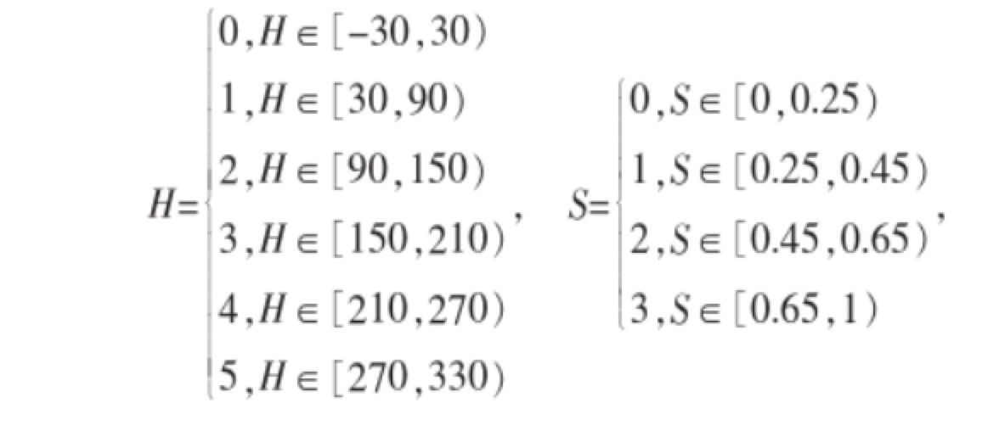
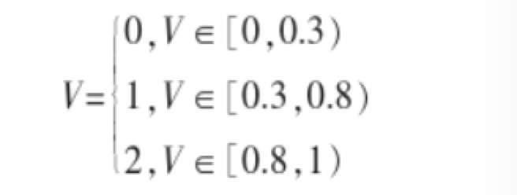
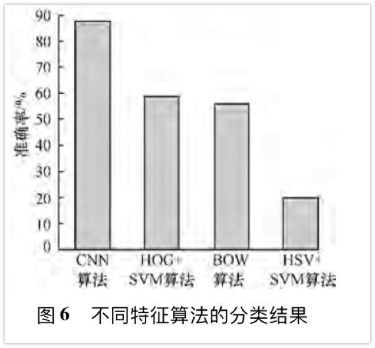
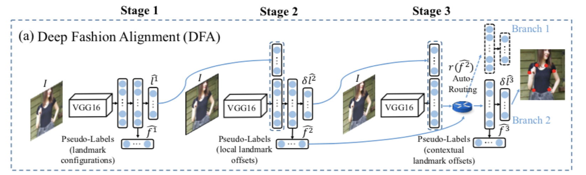
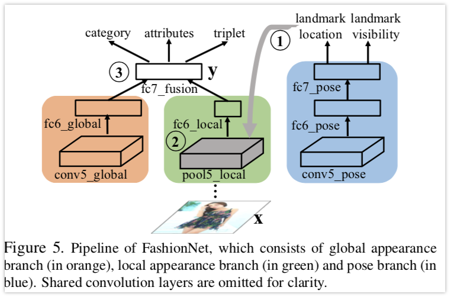

# 基于服装细节识别的服装搭配推荐文献综述
@(小组组员)[刘奇昂 邴冠文]

## 
摘要

**基于服装细节识别的服装搭配推荐**是近年兴起并快速成熟的应用场景广泛，商业价值明显的新兴技术。本文主要基于以下几个方面讨论并概括近期的研究成果和算法总结：

- **国内外研究现状**
- **基于机器学习分类算法与神经网络算法的比较**
- **参考文献列表**
## 
关键词

**机器学习，神经网络，SVM，CNN**

## 
正文

### 国内外研究现状
&emsp;&emsp;服装识别推荐是一个较为新星却比较成熟的领域，目前来说在服装推荐以及服装细节识别上，主要分为有监督神经网络和传统机器学习算法两个方面，而近年来的研究成果让两个方面的识别率都达到了较高的水准，可以说在算法方面已经比较完善。不过基于神经网络的服装细节识别相较于传统方法来说在性能上以及特征识别数目上都拥有一定的优势。

### 基于机器学习分类算法与神经网络算法的比较
**国内外传统算法总结：**
&emsp;&emsp;[^1]在服装细节识别方面传统算法主要包括基于SVM算法的WFD-LDA-SVM算法，WFD-PCA-SVM算法等。不过从近几年的研究来讲基于SVM算法的服装细节识别由于无法兼顾识别率和算法性能已经渐渐被淘汰。基于极限学习机的算法WFD-LDA-ELM等有更好的综合性能，最新研究的识别率已经在部分数据集上超过90%。
[^4]颜色分类上也摒弃了原来使用RGB三原色的方法进而使用了更接近于人眼感官颜色的HSV颜色进行分类。

之后使用直方图向量和归一化之后得出相似度。
&emsp;&emsp;[^2]在推荐算法方面，使用协同过滤算法有较好的准确性，同时结合时间时间信息变化或使用交互式遗忘算法会有更好的推荐效果。
**国内外基于神经网络CNN算法技术总结：**
&emsp;&emsp;CNN卷积神经网络在服装细节识别上相较于其他事传统算法有天然的优势，[^3]在“基于深度卷积神经网络的服装图像检索算法”论文中给出了使用不同算法的准确率图表。其中CNN算法高达87%，使用TITAN X GPU 训练3天完成。

&emsp;&emsp;近年来随着神经网络的高速发展，2014年ILSVRC的第二名Karen Simonyan和 Andrew Zisserman实现的卷积神经网络VGGNet在服装识别上有着在性能上更加优良的表现他们最好的网络包含了16个卷积/全连接层。网络的结构非常一致，从头到尾全部使用的是3x3的卷积和2x2的汇聚。他们的预训练模型是可以在网络上获得并在Caffe中使用的。使用VGG训练网络可以是识别率达到90%以上。

&emsp;&emsp;在推荐算法方面，ELM有着较为优良的性能，相比于SLFM，ELM具有获取参数容易，训练速度快，网络结构简单等优点。
### 参考文献列表
- DeepFashion: Powering Robust Clothes Recognition and Retrieval with Rich Annotations Ziwei Liu1 Ping Luo3,1 Shi Qiu2 Xiaogang Wang1,3 Xiaoou Tang1,31The Chinese University of Hong Kong 2SenseTime Group Limited 3Shenzhen Institutes of Advanced Technology, CAS 
- Fashion Landmark Detection in the Wild2 Ziwei Liu1⋆, Sijie Yan1⋆, Ping Luo2,1, Xiaogang Wang1,2, Xiaoou Tang1,2 1 Dept. of Information Engineering, The Chinese University of 	Hong Kong Shenzhen Key Lab of Comp. Vis. & Pat. Rec., Shenzhen Institutes of Advanced Technology, CAS, China 
- Parsing Clothing in Fashion Photographs Kota Yamaguchi M. Hadi Kiapour Luis E. Ortiz Tamara L. Berg Stony Brook University Stony Brook, NY 11794, USA
- 服装款式图提取及其模式识别的研究 安立新
- K. Simonyan and A. Zisserman. Very deep convolutional networks for large-scale image recognition. arXiv preprintarXiv:1409.1556, 2014
- 基于深度卷积神经网络的服装图像检索算法 第一作者 厉智
- 基于形状特征和颜色的服装图像检索 第一作者 贾巧丽
- 协同过滤的服装推荐算法的改进研究 第一作者 郑充林 

[^1]: 协同过滤的服装推荐算法的改进研究

[^2]: 协同过滤的服装推荐算法的改进研究

[^3]: 基于深度卷积神经网络的服装图像检索算法;

[^4]:基于形状特征和颜色的服装图像检索

